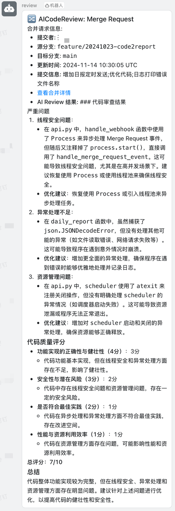
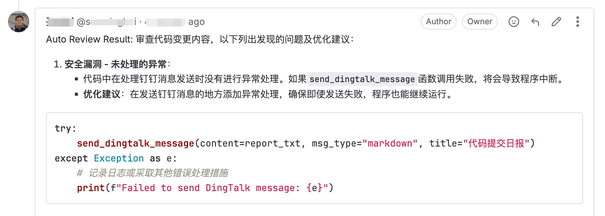
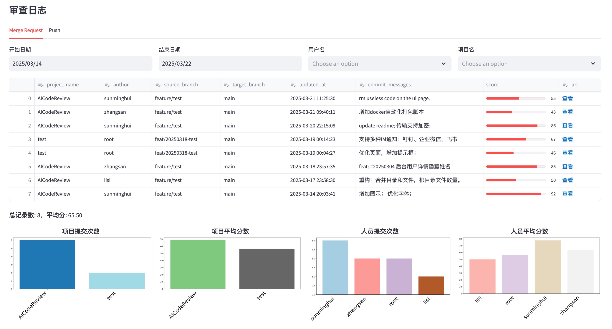
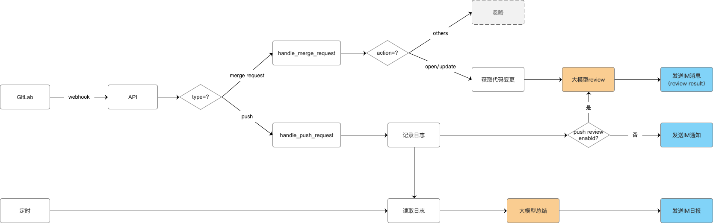

[开源版](README.md) |
[Pro版](doc/pro.md)

## 项目简介

本项目是一个基于大模型的自动化代码审查工具，帮助开发团队在代码合并或提交时，快速进行智能化的审查(Code Review)，提升代码质量和开发效率。

fork自：https://github.com/sunmh207/AI-Codereview-Gitlab

## 功能

- 🚀 多模型支持
  - 兼容 DeepSeek、ZhipuAI、OpenAI、Anthropic、通义千问 和 Ollama，想用哪个就用哪个。
- 📢 消息即时推送
  - 审查结果一键直达 钉钉、企业微信 或 飞书，代码问题无处可藏！
- 📅 自动化日报生成
  - 基于 GitLab & GitHub & Gitea Commit 记录，自动整理每日开发进展，谁在摸鱼、谁在卷，一目了然 😼。
- 📊 可视化 Dashboard
  - 集中展示所有 Code Review 记录，项目统计、开发者统计，数据说话，甩锅无门！
- 🎭 Review Style 任你选
  - 专业型 🤵：严谨细致，正式专业。
  - 讽刺型 😈：毒舌吐槽，专治不服（"这代码是用脚写的吗？"）
  - 绅士型 🌸：温柔建议，如沐春风（"或许这里可以再优化一下呢~"）
  - 幽默型 🤪：搞笑点评，快乐改码（"这段 if-else 比我的相亲经历还曲折！"）

**效果图:**







## 原理

当用户在 GitLab 上提交代码（如 Merge Request 或 Push 操作）时，GitLab 将自动触发 webhook
事件，调用本系统的接口。系统随后通过第三方大模型对代码进行审查，并将审查结果直接反馈到对应的 Merge Request 或 Commit 的
Note 中，便于团队查看和处理。



## 部署

### 方案一：Docker 部署

**1. 准备环境文件**

- 克隆项目仓库：

```aiignore
git clone https://github.com/sunmh207/AI-Codereview-Gitlab.git
cd AI-Codereview-Gitlab
```

- 创建配置文件：

```aiignore
cp conf/.env.dist conf/.env
```

- 编辑 conf/.env 文件，配置以下关键参数：

```bash
#大模型供应商配置,支持 zhipuai , openai , deepseek 和 ollama
LLM_PROVIDER=deepseek

#DeepSeek
DEEPSEEK_API_KEY={YOUR_DEEPSEEK_API_KEY}

#支持review的文件类型(未配置的文件类型不会被审查)
SUPPORTED_EXTENSIONS=.java,.py,.php,.yml,.vue,.go,.c,.cpp,.h,.js,.css,.md,.sql

#钉钉消息推送: 0不发送钉钉消息,1发送钉钉消息
DINGTALK_ENABLED=0
DINGTALK_WEBHOOK_URL={YOUR_WDINGTALK_WEBHOOK_URL}

#Gitlab配置
GITLAB_ACCESS_TOKEN={YOUR_GITLAB_ACCESS_TOKEN}
```

**2. 启动服务**

```bash
docker-compose up -d
```

**3. 验证部署**

- 主服务验证：
  - 访问 http://your-server-ip:5001
  - 显示 "The code review server is running." 说明服务启动成功。
- Dashboard 验证：
  - 访问 http://your-server-ip:5002
  - 看到一个审查日志页面，说明 Dashboard 启动成功。

### 方案二：本地Python环境部署

**1. 获取源码**

```bash
git clone https://github.com/sunmh207/AI-Codereview-Gitlab.git
cd AI-Codereview-Gitlab
```

**2. 安装依赖**

使用 Python 环境（建议使用虚拟环境 venv）安装项目依赖(Python 版本：3.10+):

```bash
pip install -r requirements.txt
```

**3. 配置环境变量**

同 Docker 部署方案中的.env 文件配置。

**4. 启动服务**

- 启动API服务：

```bash
python api.py
```

- 启动Dashboard服务：

```bash
streamlit run ui.py --server.port=5002 --server.address=0.0.0.0
```

### 配置 GitLab Webhook

#### 1. 创建Access Token

方法一：在 GitLab 个人设置中，创建一个 Personal Access Token。

方法二：在 GitLab 项目设置中，创建Project Access Token

#### 2. 配置 Webhook

在 GitLab 项目设置中，配置 Webhook：

- URL：http://your-server-ip:5001/review/webhook
- Trigger Events：勾选 Push Events 和 Merge Request Events (不要勾选其它Event)
- Secret Token：上面配置的 Access Token(可选)

**备注**

1. Token使用优先级

- 系统优先使用 .env 文件中的 GITLAB_ACCESS_TOKEN。
- 如果 .env 文件中没有配置 GITLAB_ACCESS_TOKEN，则使用 Webhook 传递的Secret Token。

2. 网络访问要求

- 请确保 GitLab 能够访问本系统。
- 若内网环境受限，建议将系统部署在外网服务器上。

### 配置消息推送

#### 1.配置钉钉推送

- 在钉钉群中添加一个自定义机器人，获取 Webhook URL。
- 更新 .env 中的配置：
  ```
  #钉钉配置
  DINGTALK_ENABLED=1  #0不发送钉钉消息，1发送钉钉消息
  DINGTALK_WEBHOOK_URL=https://oapi.dingtalk.com/robot/send?access_token=xxx #替换为你的Webhook URL
  ```

企业微信和飞书推送配置类似，具体参见 [常见问题](doc/faq.md)

如果你使用的是企业微信机器人，并且只想在低分 Review 时推送，可以额外配置分数阈值：

```
# 企业微信配置
WECOM_ENABLED=1
WECOM_WEBHOOK_URL=https://qyapi.weixin.qq.com/cgi-bin/webhook/send?key=xxx
WECOM_SCORE_THRESHOLD=80
```

配置后，仅当 AI Review 分数严格小于 `WECOM_SCORE_THRESHOLD` 时才会推送企业微信消息；留空则保持当前行为，仍然推送所有 Review 结果。该阈值仅作用于带 Review 分数的代码审查通知，不影响钉钉、飞书和其他类型通知。

如果有多个仓库需要发往不同的企业微信机器人，或每个仓库需要不同的低分阈值，可以配置 `conf/review_rules.yml`：

```yaml
defaults:
  wecom_score_threshold: 80
  review_skip_regex:
    - "\\[skip review\\]"

repositories:
  my-group/my-repo:
    wecom_webhook_url: "https://qyapi.weixin.qq.com/cgi-bin/webhook/send?key=xxx"
    wecom_score_threshold: 70
    review_skip_regex:
      - "^WIP:"
```

仓库规则优先级高于 `.env`。`review_skip_regex` 会匹配 MR/PR 标题和 commit message；Push 事件只匹配 commit message。命中后不会调用 AI Review，也不会写平台 note 或发送 Review 结果通知。

## 常见问题

**1.如何对整个代码库进行Review?**

可以通过命令行工具对整个代码库进行审查。当前功能仍在不断完善中，欢迎试用并反馈宝贵意见！具体操作如下：

```bash
python -m biz.cmd.review
```

运行后，请按照命令行中的提示进行操作即可。

**2.其它常见问题**

参见 [常见问题](doc/faq.md)
